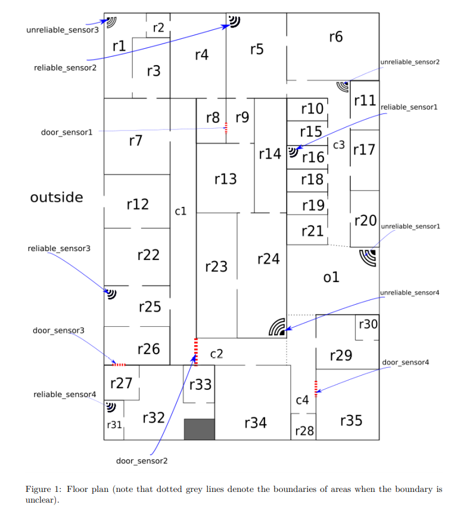
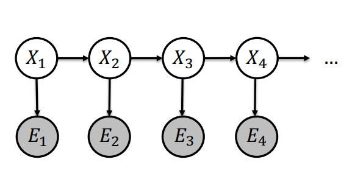

# COMP9418 ADVANCED MACHINE LEARNING ASSIGNMENT 02 YEAR: 2020 TERM: 03

# AIM

- Write a program that plays the part of a "smart building".
- Input to the program will be a real-time stream of sensor data from  throughout the building.
- Use this data to decide whether to turn on the lights in each room.
- Goal is to minimize the cost of lighting in the building, while also trying to make sure that the lights stay on if there are people in a room.
- Every 15 seconds, the program will recieve a new data point and it has to decide whether each light should be turned on or off.
- There are several types of sensors in the building, each with different reliability and data output.
- You will be given a file called data.csv containing one day of complete data with all sensor values and the number of people in each room.
- Your solution must include a Probabilistic Graphical Model as the core component.

# DATA
- The file data.csv contains complete data that is representative of a typical weekday in the office building.
- This data includes the output of each sensor as well as the true number of people in each room.
- This data was generated using a simulation of the building, and the program will be tested against many days of data generated by the same simulation.
- We are given only 2400 complete data points, from a single workday.
- The simulation attempts to be a realistic approximation to reality, so it includes many different types of noise and bias.

## SENSOR DATA

-  Submission file contains a function called get_action(sensor_data), which receives sensor data in the following format:

sensor_data = {'reliable_sensor1': 'motion', 'reliable_sensor2': 'motion',
'reliable_sensor3': 'motion', 'reliable_sensor4': 'motion',
'unreliable_sensor1': 'motion', 'unreliable_sensor2': 'motion',
'unreliable_sensor3': 'motion', 'unreliable_sensor4': 'motion',
'door_sensor1': 0, 'door_sensor2': 0, 'door_sensor3': 0, 'door_sensor4':0,
'robot1': ('r1', 0), 'robot2': ('r16', 0), 'time': datetime.time(8, 0), 'electricity_price': 0.81}

- The possible values of each field in sensor_data are:
    - reliable_sensors: can have values ['motion', 'no motion']. All reliable_sensors are of the same brand and are usually quite accurate.
    - Unreliable_sensors: can have values ['motion', 'no motion']. Unreliable_sensors are a different type of motion sensor, which tend to be a little less accurate.
    - door_sensors: count how many people passed through a door (in either direction, so it can be any integer).
    - The robot sensors are robots that wander around the building and count the number of people in each room.
        - The value is a 2-tuple of the current room and the number of people counted. example -> ('r4', 8).
    - Any of the sensor may fail at any time, in which case they will have the value None. They may start working again.

    - time: A datatime.time object representing the current time.
        - Datapoints will be provided in 15 seconds resolution i.e., function will be given input of data points from 15 second intervals from 8 am - 6 pm.

## TRAINING DATA

- The file data.csv contains for each of the above sensors as well as columns for each room, which tell us the current number of people in that room.
- The columns of data.csv are the following and can be divided into two groups:
    - Columns that represent readings from the sensors = ['reliable_sensor1', 'reliable_sensor2', 'reliable_sensor3', 'reliable_sensor4', 'unreliable_sensor1', 'unreliable_sensor2', 'unreliable_sensor3', 'unreliable_sensor4', 'robot1', 'robot2', 'door_sensor1', 'door_sensor2', 'door_sensor3', 'door_sensor4', time, electricity_price].
    - Columns that provide the ground truth with the number of people in each room, corridor, open area, and outside the building = ['r1', 'r2', 'r3', 'r4', 'r5','r6', 'r7', 'r8', 'r9', 'r10', 'r11', 'r12', 'r13', 'r14', 'r15', 'r16', 'r17', 'r18', 'r19', 'r20', 'r21', 'r22', 'r23', 'r24', 'r25', 'r26', 'r27', 'r28', 'r29', 'r30', 'r31', 'r32', 'r33', 'r34', 'r35', 'c1', 'c2', 'c3', 'c4', 'o1', 'outside']

## ACTION DATA

- get_action() must return a dictionary with the following format.
- Note: Every numbered room named "r" in the building has lights that we can turn on or off.
- All other rooms/corridors have lights that are permanently on, which we cannot control and have no impact on the cost.

actions_dict = {'lights1': 'off', 'lights2': 'off', 'lights3': 'off',
'lights4': 'off', 'lights5': 'off', 'lights6': 'off', 'lights7': 'off',
'lights8': 'off', 'lights9': 'off', 'lights10': 'off', 'lights11': 'off',
'lights12': 'off', 'lights13': 'off', 'lights14': 'off', 'lights15': 'off',
'lights16': 'off', 'lights17': 'off','lights18': 'off', 'lights19': 'off',
'lights20': 'off', 'lights21': 'off', 'lights22': 'off', 'lights23': 'off',
'lights24': 'off', 'lights25': 'off', 'lights26': 'off', 'lights27': 'off',
'lights28': 'off', 'lights29': 'off','lights30': 'off', 'lights31': 'off',
'lights32': 'off', 'lights33': 'off', 'lights34': 'off','lights35': 'off'}

- The outcome space of all actions = ('on', 'off').

## COST SPECIFICATION

-  If a light is on for 15 seconds, it usually costs about 1 cent.
- The exact price of electricity goes up and down and it is included in the sensor_data.
- if there are people in a room and there is no light on, it costs 4 cent per person every 15 seconds.
- Goal is to minimize the total cost of lighting plus the lost productivity, added up over the whole day.

# CONSTRAINTS
- The program should not run longer than 1800 seconds for 10 days (180s/day).

# SMART BUILDING FLOOR PLAN

# IMPLEMENTATION

## HIDDEN MARKOV MODEL

- is an instance of Dynamic Bayesian Networks (DBN).
- They have a repeating structure that grows with time or space.
- Such structure uses the markov property. (Markov property states that the future states are independent of past ones given the current state).
- We also know that the HMM extend the chains by allowing the hidden states.
- HMM are Markov chains where the states are not dirctly observable.

- HMM has 2 components
    - Underlying Markov chain over states X.
    - Observable outputs (effects of the states) at each time step. These outputs are often called emissions.

### HMM PARAMETERS

- Intial distribution P(X1) which in this case is numpy 2-D array 1 X 41. 41 since the number of rooms as shown in the floor plan. Every room is assigned the zero value except outside is set to 1. 1 here represents that no one inside the building and everyone is outside the building. This also represents that all the lights are off (0) inside the building and only the outside light is on (1).

- Transition probabilities P(Xt| Xt-1): which is represented by a 41 x 41 matrix. This represents the probablity of a person moving from room A to room B.

    - While calculating the transition probabilties, an assumption was made that people could only move to a limited number of rooms. This assumption was represented as a graph.

    - The whole data was divided into 5 sections of 500 and Transition matix was calculated separately for each of the section. The rationale behind that is as the electricity charges vary in the data. The model was better able to learn this change rather than in the case for only a single transiton matrix is calculated for the whole day. This also represents another assumption of HMM that the transition probabilities stay constant for 500 time units.

- Emission Probabilities P(Et|Xt): which is represented by the reliability of the sensors i.e. the probablity the sensor is giving the correct value of the count of the people.

#### ASSUMPTIONS

- This model follows the independence assumptions of the hidden markov model.
    - A room state is independent of all the past room states and all the past evidence (sensor) given the previous room state. (Markove property)
    - Xt ⊥ X1, ..., Xt-2,E1, ..., Et-2|Xt-1

    - Evidence (Sensor) is independent of all past evidence (sensor) and all past room states given the current room state (independence of observations)
    - Et ⊥ X1, ... , Xt-1,E1, ... , Et-1 | X1
    - Transition and emission probabilities are the same for 500 values of t as opposed to all values. (stationary process).

### HOW THE MODEL WORKS

- file_name: example_solution_latest.py
- Start_states: is a 1 x 41. where 41 corresponds to the state of the room. all the 40 states of room is set to zero and outside is set to one. This represents the starting state that no one is in the building.
- state: represents the current state of the room at any given t.
- previous_state: represents the previous state at t-1.
- threshold: 0.2, this is a hyperparameter used to decide if we want to replace the current state value of a room with the reliability value of the sensor. This will be explained later.
- reads the relvant transiton matrix keeping in mind the value of t. (the method to calculate the transition matrix is explained later)
- reads the reliabilties of the sensors. (the method to calculate the reliabilties of the sensor is explained later)
- replaces the sensor values of motion and no motion with 1 and 0 respectively.
- To update the states of all the rooms for any value of t, it iterates over all the sensors and 
    - first checks if the sensor value is not equal to None (None represents that the sensor stopped working). if the sensor is working, then the states of the rooms is simply updated using the following formula:
        - state = previous_state @ transtion_matrixt
            - @ here represents a matrix multiplication.
            - shape of state = (1x41), shape of previous_state = (1x41), shape of transition_matrix = (41x41).
    - else if the sensor is not working, we set the set of that room to zero and update the states using the same above formula.
- After that, it takes into account the values that the robots are reporting. it replaces the state of the room for which robot is reporting the count of people.
- After that it takes into account the values of the sensors.
    - iterates over all the non_door_sensors
        - it finds the difference between the previous state of the room and the current state of the room and if it is less than the threshold (hyperparameter) value of 0.2 then the current state value of the room is replaced by the sensor value (reliability of the sensor).
        - Hyperparameter threshold was fine-tuned manually and it is a way for the model to make a decision when to incorporate the values of the sensors.
- Prediction is made for all the rooms. The decision to turn a light on or off of a room is again made on the basis of a hyperparameter values. which again where fine tuned to reduce the cost of the electricity keeping in view both the penalties described above.

### CALCULATING THE RELIABILITY OF THE SENSORS
- file_name: version_final.py.
- One of the first steps was to calculate the reliability of the sensors i.e. the number of times the sensor is predicting the correct values for count of people in the room.
    - Replace the motion and non_motion values with 1 and 0 respectively.
    - Create a numpy array for the dataset with the columns of sensors and also the ground truth.
    - Create a list of all the sensors.
    - Create a dictionary of sensors against their locations.
    - iterate over the list of sensors.
        - Pick a sensor compare its value at the same time unit against the ground truth value using the dictionary of sensors and locations.
        - if the value of both the columns i.e. the sensor column and ground truth value match then count them.
        - find the total number of values for the sensor.
        - Divide the count with the total to find the probability that the sensor is giving the correct value.
        - Subtract the probablity from 1 to get the probability that the sensor is not giving the correct value.
        - move to the next sensor.
    - store all the probablities of all the sensors in a file 'reliability_sensors.csv' as these are our parameters for the model.

### CALCULATING THE TRANSITIONS AND CREATING TRANSITIONS MATRIX

- Create a 2-d numpy array of shape 41x41 with all values initialized to zero.
- set the value of begin = 0 and set the value of end = 500 as we are dividing the day into 5 parts.
- iterate for 5 times.
    - extract the subset of data for the current time frame.
    - iterate for 500 times.
        - iterate over all the keys of the graph.
            - check the values of the current room column from top to bottom and check if we find an instance where the first value is greater than the second value. (remember we are checking vertically).
            - if we do find an instance like this, we find the difference.
            - After finding the difference, we try to figure out in which rooms people moved to from the current room they were in. We do this using the graph we have declared earlier.
            - The graph tells us that for any room, where the people can move to. So for a room node in a graph, the child of that node are the possible rooms that a person can move to.
            - For each child, we check if the value of the child increased in the next time value than the value of the child in the current time step. if this was the case, we increament the value in the transition matrix such that the row index is the current room and column index is the room where people moved to.
        - iterate over all the keys in the graph, now calculate the probability from one room to another, for now we will not calculate the probablity of staying in the same room.
            - To calculate the probability of a person moving from one room to another
                - we first calculate the sum of that room column from the ground truth. Tis represents the total number of people in a room over a period of 500 time units.
                - then we divide the row of the transition matrix for this room with the sum we calculated in the first step.
                - Lastly, to calculate the probabilities of staying in the same room is done by adding the row of the matrix for a room and subtracting it from 1.
- This whole process generates a transition csv file which represents the transition matrix for the 500 units of time.   

# RESULTS

# Assignment Score
## Cost: 66,453.66
## Time: 116